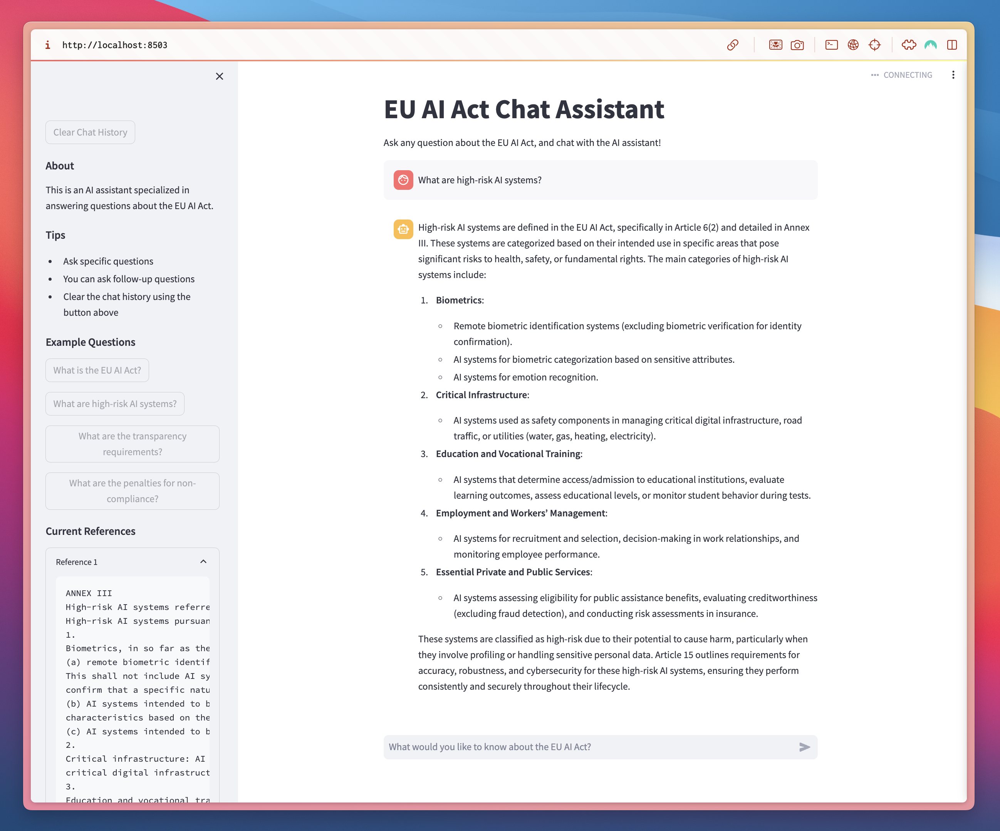

# EU AI Act Chat Assistant

This project provides an interactive Streamlit-based chat assistant designed to answer questions about the EU AI Act. It leverages a retrieval-augmented generation (RAG) system to fetch and present relevant information from the EU AI Act documents, using OpenAI and ChromaDB for document embedding and search functionalities.



## Features
- **Interactive Chat Interface**: Users can ask questions about the EU AI Act and receive real-time answers from the assistant.
- **Reference Retrieval**: Provides references to relevant sections of the EU AI Act document in response to user queries.
- **Clear Chat History**: Users can reset their chat history at any time.
- **Sample Questions**: The sidebar includes sample questions for quick reference.
- **Document Overview**: Summarizes available documents in the sidebar for easy access.

---

## Project Structure

- **streamlit_app.py**: Defines the chat UI in Streamlit, handles chat history, and displays references.
- **rag_system.py**: Manages the RAG system by embedding and storing the EU AI Act document and querying relevant sections for answers.

---

## Installation

### Requirements
- Python 3.7+
- OpenAI API key stored in a `.env` file as `OPENAI_API_KEY`

### Setting Up the Virtual Environment

#### Windows
```bash
# Clone the repository and navigate to the project directory
git clone https://github.com/ingridstevens/EUAIAct
cd EUAIAct

# Create a virtual environment
python -m venv env

# Activate the virtual environment
env\Scripts\activate

# Install dependencies
pip install -r requirements.txt
```

#### macOS / Linux
```bash
# Clone the repository and navigate to the project directory
git clone https://github.com/ingridstevens/EUAIAct
cd EUAIAct

# Create a virtual environment
python3 -m venv env

# Activate the virtual environment
source env/bin/activate

# Install dependencies
pip install -r requirements.txt
```

> Ensure that the OpenAI API key is set up in the `.env` file:
>
> ```plaintext
> OPENAI_API_KEY=your_openai_api_key_here
> ```

---

## How to Run the Project

### Start the Chat Application
1. Activate your virtual environment:
   - **Windows**: `env\Scripts\activate`
   - **macOS/Linux**: `source env/bin/activate`
2. Run the Streamlit app:
   ```bash
   streamlit run streamlit_app.py
   ```
3. Open the link provided in the terminal (usually [http://localhost:8501](http://localhost:8501)) to interact with the assistant.

---

## How It Works

### Chat Interface (`streamlit_app.py`)
- **Main Interface**: Displays the title and a brief prompt for users to ask questions.
- **Message History**: Shows previous messages from the user and assistant, storing chat history in session state.
- **Sidebar**: Contains options to clear chat history, view example questions, and reference current documents.

### RAG System (`rag_system.py`)
- **Document Embedding and Search**: The EU AI Act document is embedded and stored in ChromaDB. The system retrieves relevant sections when a query is made.
- **Answer Generation**: Constructs a response based on relevant document excerpts and the question, using the OpenAI API.

---

## Example Usage

1. Launch the app with `streamlit run streamlit_app.py`.
2. Ask questions like “What is the EU AI Act?” or “What are high-risk AI systems?”
3. The assistant responds, providing references to specific parts of the EU AI Act.

---

## Notes

- Ensure you have the `EU_AI_Act.pdf` document in the project directory for document embedding.
- This project uses the `gpt-4o-mini` model for faster responses. Ensure the model is specified correctly in the OpenAI API setup.

---

## License
This project is licensed under the MIT License.
